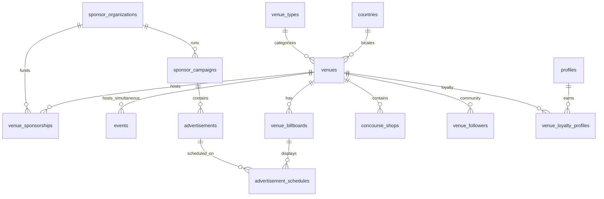

# LiveCircuit Virtual Venue Network & Sponsorship — Database Architecture

## Milestone 1 deliverable

This document describes the normalized schema introduced in migration `20250721000009_venue_network_sponsorship.sql`. Application layers (management UI, landing pages, concourse, sponsor dashboards) build on these tables without replacing existing tour/event flows.

## Design principles

1. **Events stay first-class** — Each performance remains a row in `events` with its own stream, chat, tickets, and analytics. Venues aggregate many simultaneous events via `events.venue_id` (nullable for legacy shows).
2. **Scale** — Composite indexes on `(venue_id, status)`, `(venue_id, scheduled_at)`, and time-series tables keyed by `(entity_id, bucket_date)` support pagination and rollups at high volume.
3. **Sponsorship as CRM** — Organizations, memberships, contracts (`venue_sponsorships`), campaigns, creatives, placements, and metrics are separate tables for enterprise reporting.
4. **Founding Sponsor scarcity** — At most one active founding naming sponsorship per venue (`is_founding_sponsor` + partial unique index).
5. **VR-ready, not VR-built** — `venues.vr_config`, `venues.concourse_layout`, and `concourse_shops.zone` store spatial metadata for a future client; no runtime VR in Phase 3 M1.

## Entity relationship overview



## Core tables

| Table | Purpose |
| --- | --- |
| `venue_types` | Arena, Theater, Comedy Club, … — branding defaults and icon keys |
| `venues` | Permanent regional venues (slug, geo, capacity, hero, popularity, VR/concourse JSON) |
| `venue_featured_artists` | Curated artists on venue landing pages |
| `venue_themes` | Seasonal theme catalog (Summer Festival, Halloween, …) |
| `venue_theme_assignments` | Active theme window per venue |
| `events.venue_id` | Links any event to a venue room; unlimited concurrent rows per venue |

## Sponsorship & advertising

| Table | Purpose |
| --- | --- |
| `sponsor_organizations` | Company profile, logo, billing contact |
| `sponsor_organization_members` | Dashboard access (`owner`, `analyst`, `viewer`) |
| `venue_sponsorships` | Naming rights, booths, VIP lounge, etc.; **founding** tier + renewal flags |
| `sponsor_campaigns` | Budget, flight dates, status |
| `advertisements` | Creative payload (image, HTML, future video URL) |
| `billboard_location_types` | Homepage, concourse, loading, VIP, exit, splash, … |
| `venue_billboards` | Physical/logical ad slot in a venue (or global when `venue_id` null) |
| `advertisement_schedules` | Which ad runs on which slot, with priority |
| `sponsor_coupons` | Promo codes tied to campaigns |
| `coupon_redemptions` | Fan downloads/redemptions |

## Analytics & performance

| Table | Purpose |
| --- | --- |
| `advertisement_impressions` | Append-only; indexed by ad + time |
| `advertisement_clicks` | Append-only; optional `user_id` |
| `venue_analytics_daily` | Visitors, revenue, tickets, merch, peak traffic per venue/day |
| `sponsor_campaign_metrics_daily` | Impressions, clicks, conversions, geo demo JSON per campaign/day |
| `venue_leaderboard_snapshots` | Periodic materialized rankings (artists, fans, tips) |

## Community & loyalty

| Table | Purpose |
| --- | --- |
| `venue_followers` | Follow venue; drives follower_count |
| `venue_reviews` | 1–5 stars + body per user per venue |
| `venue_posts` | Discussion board threads |
| `venue_announcements` | Official venue news |
| `venue_loyalty_profiles` | Points + level (`bronze` … `diamond`) |
| `venue_loyalty_ledger` | Point deltas with reason codes |
| `venue_check_ins` | Event/concourse check-ins for loyalty |
| `venue_badges` / `user_venue_badges` | Collectibles tied to venues |

## Concourse

| Table | Purpose |
| --- | --- |
| `concourse_shops` | Merch, food sponsor, kiosk, charity booth, etc. |
| `concourse_shop_products` | Optional link to `products` or external URL |

## RLS summary

- **Public read**: active venues, types, themes, schedules for active ads, public posts/reviews/leaderboards.
- **Authenticated fans**: follow, review, post, check-in, redeem coupons; loyalty ledger read own.
- **Sponsor members**: read/update own org, campaigns, ads, metrics (org-scoped).
- **Admins**: full CRUD on venues, sponsorships, moderation, themes, billboards.

Service-role workers (future) should aggregate `advertisement_*` into `*_metrics_daily` and refresh `current_visitors` / `popularity_score`.

## Seeded data

Migration seeds all `venue_types`, global `billboard_location_types`, catalog `venue_themes`, and **15 flagship venues** (NYC, Buffalo, Albany, Boston, …) with slugs matching `/livecircuit/venues/{slug}` (route added in a later milestone).

## Applying

```bash
npx supabase db push
npm run db:types   # after link
```

## Next milestones (not in M1)

2. Venue management (admin + APIs)  
3. Venue landing pages  
4. Simultaneous event assignment UX  
5. Digital concourse UI  
6. Sponsorship platform & checkout for sponsors  
7. Sponsor analytics dashboards — `/sponsor/dashboard/[orgId]` **Analytics** tab; `GET /api/sponsors/[orgId]/analytics?days=30&format=csv|json`; merges `sponsor_campaign_metrics_daily` with live rollups from `advertisement_impressions` / `advertisement_clicks`; impression beacons on homepage, venue hero, and concourse billboards.
8. Venue communities UI — `/livecircuit/venues/[slug]/community` (discussions, reviews, announcements, leaderboard); `GET /api/venues/[slug]/community`; follow + post/review actions; teaser on venue landing; admin moderation tab links to public hub.
9. Loyalty & achievements — per-venue points ledger (`venue_loyalty_profiles` / `venue_loyalty_ledger`), tier progress (bronze→diamond), badge criteria + `user_venue_badges`, achievement posts, check-in/review point awards, top-fans leaderboard refresh, `/livecircuit/venues/[slug]/loyalty` and community **Loyalty** tab; migration `20250721000013_venue_loyalty_badges.sql`.
10. Seasonal themes — `VenueThemeShell` applies catalog palettes/assets across venue landing, concourse, community, and loyalty; CSS variables + hero overlays; directory cards show active theme chips; `GET /api/venues/[slug]/theme`; migration `20250721000014_venue_theme_assets.sql` (palettes + demo assignments).
11. Performance & scalability — see `docs/PERFORMANCE.md` (tagged Next.js cache, CDN headers, community cursor pagination, BRIN indexes + rollup RPC + Vercel cron for sponsor metrics).
